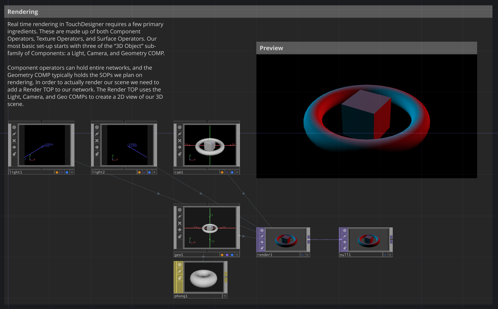
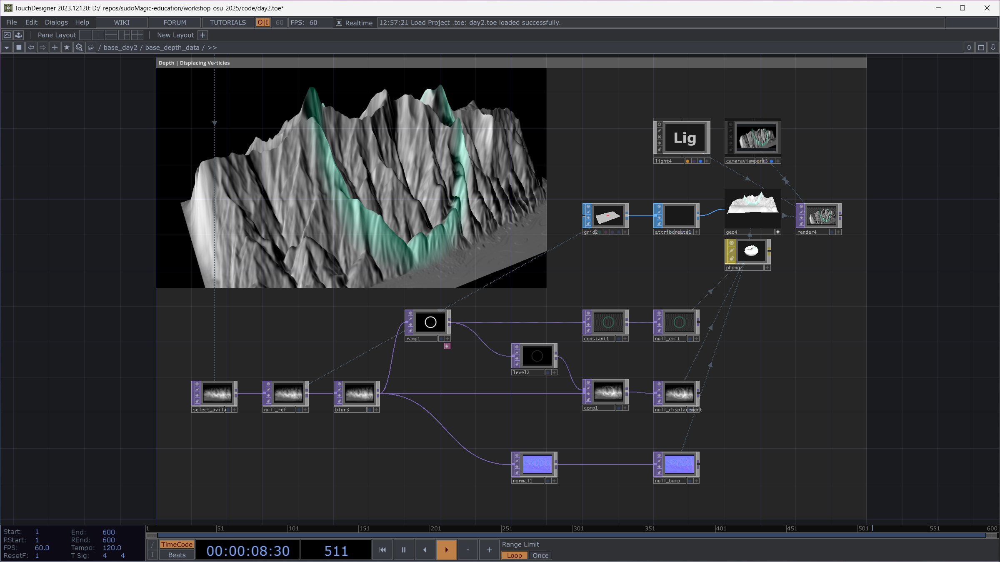

# TD Workshop OSU 2025

## TD Details

* Workshop TouchDesigner version - 2023.12120
  * [downloads page](https://derivative.ca/download/archive)
* Additional Workshops Assets
  * [Simulation Data](https://drive.google.com/drive/folders/1ffazPZnAo22M7noSylcx9obg2IPR9jN-?usp=drive_link)

---

## A little about SudoMagic and  this workshop

SudoMagic will be hosting an artist talk, industry Q&A, and a three-day TouchDesigner intensive. TouchDesigner is a visual programming environment for creating everything from visual sketches to robust applications in the media and technology space. Over the course of three days, participants will walk away with: an understanding of working with the environment, creating realtime video effects, rendering 3D scenes, and building communication pipelines with other tools. This workshop will largely focus on techniques for live performance, data processing, and interactive applications.

SudoMagic is a boutique software and design studio that partners with organizations to bring their creative and technical ideas to life. The team at SudoMagic has produced everything from branded activations to immersive experiences, from permanent installations to bespoke pipeline tools and resources. Their clients include Meta, T-Mobile, UCLA, and Derivative among others.

In addition to commercial work, SudoMagic is an education and research focused studio. Most recently they collaborated with Derivative, makers of the TouchDesigner software, to help develop the official TouchDesigner Curriculum.

---

## Getting Ready

Before we begin, there are a few important things to keep in mind that will make the workshop run smoothly, and ensure you can focus on getting the most out of our time together. Below you’ll find a list of required first steps / tools to have with you, and some recommended steps to help you prepare.

### REQUIRED

Bring you Laptop – Mac or PC. Make sure you review the [System Requirements] from Derivative so you know you have a machine that’s TouchDesigner ready.
Don’t forget your power adapter – TouchDesigner is largely a GPU based environment. This makes for fast operations, but often means that your battery will get consumed quickly. You’ll definitely want your adapter, even if it’s a pain to lug around.

Download [TouchDesigner 099] – it’s very important to make sure your machine can run TouchDesigner before you get to the workshop. There are some specific graphics card requirements and making sure everything works before the first day will make sure we can get the group started right away. We'll be using the latest stable version of TouchDesigner for the workshop - if you have an older version installed, just know that some examples in the workshop may look a little different.

Get your TouchDesigner 099 License – you can register for a Derivative account here - [Derivative Registration], and that will make sure you can create a non-commercial license key. The non-commercial license is free, and we won’t need anything more than this for our workshop.

### RECOMMENDED

**A 3 Button mouse** – You certainly can use a track pad while you’re working, but you’ll be much happier to have an actual mouse for working in Touch.
Download and Install a text Editor – [Visual Studio Code] is a great place to start if you don't have one.

**Bring some Assets** – You certainly don’t have to bring any extra assets, but it’s often nice to have more than just the stock images / videos handy.

**Be ready to share your contact info** – the best resources you’ll find at any workshop will be the other people in the room with you. If you’ve got some extra business cards make sure you bring a stack to share with the folks in our group.

### BE INSPIRED

Take a look at some of the projects featured on the [Derivative Blog] to see what people are making and doing with TouchDesigner.

## Workshop summary

Over the course of three days, participants will walk away with:

* an understanding of working with the environment
* creating realtime video effects
* rendering 3D scenes
* building communication pipelines with other tools.

This workshop will largely focus on techniques for live performance, data processing, and interactive applications.

## Schedule

### Friday

A brief overview here

| Time    | Topic                                           |
| ------- | :---------------------------------------------- |
| 3:00 PM | Intro, Context & Routable                       |
| 3:30 PM | Artist Talk & QA - Matthew & Zoe from SudoMagic |
| 4:00 PM | What is TouchDesigner                           |
| 4:30 PM | Navigating the Environment                      |
| 5:00 PM | Break                                           |
| 5:30 PM | Operator Families                               |
| 6:00 PM | Live Camera Video FX                            |
| 7:00 PM | Realtime Rendering                              |
| 8:00 PM | Wrap                                            |

### Saturday

A brief overview here

| Time    | Topic                                     |
| ------- | :---------------------------------------- |
| 3:00 PM | Intro to Instancing                       |
| 3:30 PM | Data Driven Instances                     |
| 4:00 PM | Visualizing Motion Capture Data           |
| 5:00 PM | Break                                     |
| 5:30 PM | Working with Depth Data                   |
| 6:30 PM | Using Point Cloud Files                   |
| 7:30 PM | Audio Reactivity                          |
| 8:00 PM | Wrap                                      |

### Sunday

A brief overview here

| Time     | Topic                                                        |
| -------- | :----------------------------------------------------------- |
| 10:00 AM | Communicating with other applications - OSC and other communication protocols                 |
| 10:30 AM | Open Hack-a-thon / Coding Circle - small group or individual creative work hours with Zoe & Matt |
| 12:30 PM | Break                                                         |
| 1:00 PM  | Faculty / Staff Collaborative working session w/ Zoe & Matt                           |
| 3:00 PM  |Wrap                           |

# Workshop Day 1

On our first day we'll focus on the basics. We'll start with a quick round of introductions and then dive into working with TouchDesigner. We'll start by looking at the user interface, and learning about the different operator families. We'll then get started right away by setting up a render network, and working with post processing effects. There are lots of ways we can manipulate video in TouchDesigner, and getting a firm handle on what image manipulation looks like will set us up for working with camera effects in the late afternoon. We'll warp the day by looking at creating custom parameters and outputting our content to another window or another screen.

During the workshop we'll create everything together so you have the hands on experience of building networks yourself. While that's great for working in the moment, sometimes you want (or need) an extra reference. The workshop repo also contains a file that's the end of day file - this contains all of the exercises we've gone over together in the workshop. This can be helpful as a reference, but also if you get stuck and need to compare you work to an example.

The first time you open any new application it can be frustrating or confusing as you try to understand how the interface works. TouchDesigner is a node based toolkit, and while it's similar to many tools, it's also distinctly unique. We'll take a little time to cover the basics of getting around the environment, and how to understand what we're seeing. Before you know it you'll be zooming around your networks like it's second nature.

> Half of learning a new tool or development environment is just figuring out where all the knobs and buttons are. In this first course we’ll focus on getting your bearings in TouchDesigner, learning the essential interface elements and controls, as well as the fundamental principles of each operator family.

Learn more at [Navigating the TouchDesigner Environment](https://learn.derivative.ca/courses/100-fundamentals/lessons/101-navigating-the-environment/)

## Navigating the Environment
Some additional content here

## Operator Families

Operators are the building blocks of our TouchDesigner networks. In a typically TouchDesigner project you'll find a series of operators connected by wires into a network. These networks make up the code for your project. The operators in our networks are separated into families which also represent that kinds of data that they contain.

### TOPs

> A picture’s worth a thousand words… in TouchDesigner we work with images all the time, and the texture operator family is our primary means of manipulating pixels. From importing files to building visual FX this course will look at how we work with images and video, and how we can manipulate them in TouchDesigner.

Learn more at [Working with TOPs](https://learn.derivative.ca/courses/100-fundamentals/lessons/102-tops-working-with-images/)

### CHOPs

> Channel operators (CHOPs) are the signals and controls that bring a TouchDesigner project to life. CHOPs bring in controls from outside devices, allow us to work with Audio, build simple state machines, and animate elements in the network. This course will cover the principal aspects of the channel operator family, as well as examine use cases and mechanics that will help you build your first interactive project.

Learn more at [Working with CHOPs](https://learn.derivative.ca/courses/100-fundamentals/lessons/103-chops-working-with-signals/)

### SOPs

> With a long history in authoring 3D worlds and figures, TouchDesigner’s roots reach back to principles of non-destructive procedural geometry authoring. Surface Operators (SOPs) are the geometric and modeling primitives in the TouchDesigner environment; they’re also our introduction to the world of real time rendering and open a world of opportunities for creating both artistic and technical visual worlds

Learn more at [Working with SOPs](https://learn.derivative.ca/courses/100-fundamentals/lessons/104-sops-rendering-3d-scenes/)

### DATs

> Text, tables, and scripts – a little bit of Python can go a long way; from controlling how operators function in the network, to more complex state and preset machines. While it’s not required that you learn Python to use TouchDesigner, it does open a wide world of possibilities for expanding your projects and creativity. In this course we’ll dip our toe into the scripting waters while also learning about the flexibility and power of the text based operators in TouchDesigner.

Learn more at [Working with DATs](https://learn.derivative.ca/courses/100-fundamentals/lessons/107-dats-scripting-python/)

### COMPs

> Making something visually compelling only half the story, it’s also important to consider how you paint the world with the pixels you’ve manipulated. In this course we’ll look at the essential organization and output mechanics for displaying your work on a screen or through a projector. We’ll also look some the high level organizational capabilities in TouchDesigner, and how this can make your projects easier to navigate.

Learn more at [Working with COMPs - Network Organization](https://learn.derivative.ca/courses/100-fundamentals/lessons/105-comps-interfaces-organization-outputs/)

> In addition to building aesthetically focused elements, TouchDesigner is also used to author full UI packages for applications, exhibition pieces, and installations. In this lesson, we’ll look at the building blocks for creating interactive user interfaces, as well as how to build resolution adaptable elements.

Learn more at [Working with COMPs - Building Interfaces](https://learn.derivative.ca/courses/100-fundamentals/lessons/106-comps-interface-building-and-controls/)

### Connecting Families

While it’s great to see how we connect operators of like families together, most of the work we do with TouchDesigner often requires connecting operators of different families together. Here we’ll look at a few simple examples of how we can start building relationships between operators of different families, and how we can use these ideas to build responsive and interactive networks.

## Live Camera Video FX

There's no shortage of things you can do with TouchDesigner, and one of the fun and exciting ways to get started learning TOPs is to build video FX networks and work with live cameras. In these examples we'll look at how we can approach several different techniques for working with video - both live footage and video files. We'll look at how simple transformations can create interesting effects with only a few nodes in our network. We'll also take a closer look at the mechanics of working with texture operators, and how you can take build your own reusable effects.

## Realtime Rendering

There are lots of ways we might use real time rendering in TouchDesigner - from rendering an abstract 3D scene to data visualization. We'll cover some of the basics that you need to know when setting up your rendering pipeline so you can start creating your own 3D scenes.

> Real time rendering in TouchDesigner requires a few primary ingredients. These are made up of both Component Operators, Texture Operators, and Surface Operators. Our most basic set-up starts with a [Light](https://docs.derivative.ca/Light_COMP), [Camera](https://docs.derivative.ca/Camera_COMP), and [Geometry COMP](https://docs.derivative.ca/Geometry_COMP). Component operators can hold entire networks, and the Geometry COMP typically holds the SOPs we plan on rendering. In order to actually render our scene we need to add a [Render TOP](https://docs.derivative.ca/Render_TOP) to our network. The Render TOP uses the Light, Camera, and Geo COMPs to create a 2D view of our 3D scene.

Learn more at [TouchDesigner Basic Render Setup](https://learn.derivative.ca/courses/100-fundamentals/lessons/104-sops-rendering-3d-scenes/topic/basic-render-setup/)

---

# Workshop Day 2

Day 2 is our opportunity to start working with data and to do some more interesting rendering. Building from Day 1, we'll start with a look at how we can work with lots of geometry. Particles, point clouds, and all sorts of data sets often produce lots of data points for us to display on screen, and we'll take some time to ensure that we understand the concepts that drive this type of rendering. We'll also take a closer look at working with different data inputs. From motion capture data to point clouds we'll examine how we can transform data into elements we can visualize on screen, and how to use that information to create events. We'll round out the day with an exploration of audio reactivity and how to start building responsive systems in TouchDesigner.

## Intro to Instancing

Briefly, instancing is the idea that we want to reuse a piece of geometry multiple times in different positions. This is generally cheaper as our GPU can do all of the work of placing copies of our geometry rather than generating new geometry (like the copy SOP). To do this we use the instancing tab on the Geometry COMP, and we need to specify the location of each of our copies of geometry.

CHOPs, TOPs, SOPs, and DATs can all be used for instancing. Here we see a brief example of each type of instancing. You can also mix and match instance sources - though you need to ensure that each source provides data for the same number of instances.

## Data Driven Instances

There's lots of data that we interact with a on a regular basis, and here we'll look at how to load an external data set, process its contents, and then use the results to drive the content we're drawing on screen. In many cases the data manipulation steps we need to accomplish are done with Channel Operators, this portion of Day 2 will give us a chance to do a deep dive on some of the magic of CHOPs.

## Visualizing Motion Capture Data

Motion capture data is increasingly present in interactive systems. From Machine Learning to large tracking systems, we often work with data that holds a presentation of positions that we want to use to draw elements on screen. Here we'll take a look at how to playback a captured motion file and how we can convert that data into something we can visualize. 

## Working with Depth Data

Depth data comes in many forms. For this portion of our workshop we'll start by looking at topographical data and how we can use this to drive displacement. We'll explore both computationally slow and fast mechanics for this style of operation and talk about the advantages of both techniques.

## Using Point Cloud Files

Point clouds are everywhere. From Splats to Spatial scans there's an increasing amount of spatial data in our day to day lives. We'll start by looking at the format of point clouds and how we can manipulate the data inside of them. Time permitting we'll explore how we can start creating bound volumes in virtual space, and applying transformation effects to those bounded regions.

## Audio Reactivity

At the end of Day 3 we'll wrap with exploring audio reactivity. As we wrap the formal instruction for the workshop we'll combine all of the techniques we've explored as we start building our first responsive system.

---

# Workshop Day 3

Day 3 is a chance to explore and create in a open lab setting - with a little help along the way in case you need it. The PatchLab @ ACCAD is focused on gathering to experiment, collaborate, and share with real-time performance software. The PatchLab is primarily for those that have previous TouchDesigner experience or have taken the workshop.

## PatchLab |  creative work open collaboration
During this block we'll have time and space for participants to start some open creative exploration. We'll be around to help answer questions, give you a nudge in a particular direction, or talk through an idea. Bring your creativity and enthusiasm for creating to share with others.

## Faculty / Staff Collaborative working session w/ Zoe & Matt
We'll wrap Day 3 with some collaborative time for faculty and staff who want to explore specific ideas, projects, or prototypes with Zoe and Matt. We have a few ideas of things to talk about / showcase, but this is designed to be a space for participants to bring their specific needs and questions as our topics of focus.

----

# Resources

* [Learn TouchDesigner from Derivative]
* [The Interactive & Immersive HQ]
* [TouchOSC]
* [OSC]
* [Visual Studio Code]
* [Derivative Blog]
* [audioAnalysis]
* [TDAbleton]

<!-- links -->
[TouchOSC]:https://hexler.net/touchoscO
[OSC]:https://opensoundcontrol.stanford.edu/
[Learn TouchDesigner from Derivative]: https://learn.derivative.ca/
[The Interactive & Immersive HQ]:https://interactiveimmersive.io/
[System Requirements]: https://docs.derivative.ca/index.php?title=System_Requirements
[TouchDesigner 099]: https://derivative.ca/download
[Derivative Registration]: https://derivative.ca/user/register
[Visual Studio Code]: https://code.visualstudio.com/
[Derivative Blog]: https://derivative.ca/showcase
[audioAnalysis]: https://docs.derivative.ca/Palette:audioAnalysis
[TDAbleton]: https://docs.derivative.ca/TDAbleton
[Pure Data]: https://puredata.info/
[MaxMSP]: https://cycling74.com/products/max
